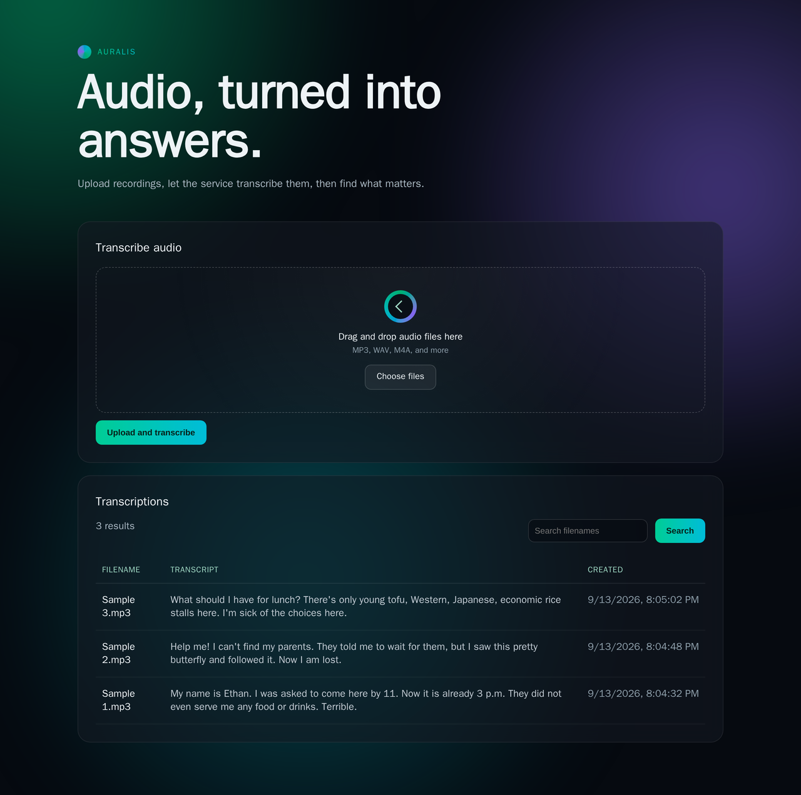

# Auralis — Audio Transcription & Search Platform

A full-stack speech-to-text application built with **FastAPI**, **React (Vite)**, **Hugging Face Whisper (`openai/whisper-tiny`)**, and **SQLite**.



---

## 🌟 Features

- **Audio Transcription Pipeline**: Ingests single or batch audio files (MP3, WAV, M4A, AAC, FLAC, OGG, Opus, WebM, MKA, AIFF, AIF, and WMA), resamples audio to 16 kHz mono float32, and runs in-process speech-to-text inference with `openai/whisper-tiny`.
- **Drag-and-Drop Upload**: HTML5 Drag & Drop onto the upload panel (with a standard file picker fallback) and a real upload-progress bar driven by `XMLHttpRequest`'s `upload.onprogress`.
- **Deduplication Engine**: Atomically reserves upload paths and checks SQLite for filename collisions, renaming colliding files to `{stem}_{uuid[:8]}{ext}` while preserving original filenames.
- **Search Functionality**: Server-backed substring search across stored and original audio filenames.
- **Containerized Architecture**: `Dockerfile` configurations for both frontend and backend, orchestrated with Docker Compose. See [Known Limitations](#-known-limitations-scope) for what "containerized" doesn't cover here (auth, horizontal scaling, TLS).
- **Automated Testing**: Unit tests covering the required endpoints and UI features for both backend (`pytest`) and frontend (`vitest` + React Testing Library).
- **Architecture Documentation**: Vector-rendered [architecture.pdf](architecture.pdf) with a component-by-component breakdown, the assumptions behind each one, and a production-scale considerations table.

---

## 🏗️ Architecture Overview

```
                        +-----------------------------------------+
                        |           Docker Compose Network        |
                        |                                         |
[ Browser / Client ] --(Port 3000)--> [ Frontend (Nginx/React) ]  |
                                                |                 |
                                        HTTP REST (JSON/Files)    |
                                                v                 |
                                      [ Backend (FastAPI) ]       |
                                         (Port 8000)              |
                                        /           \             |
                         SQL Queries   /             \ In-Process |
                                      v               v           |
                             [ SQLite DB ]    [ Whisper-Tiny ]    |
                             (auralis.db)      (Hugging Face)     |
                        +-----------------------------------------+
```

See [architecture.pdf](architecture.pdf) for the complete diagram, component breakdown, and design trade-offs.

---

## 🚀 Quick Start with Docker Compose

Ensure Docker and Docker Compose are installed and running:

```bash
# Build and start all services in detached mode
docker compose up --build

# View container logs
docker compose logs -f
```

- **Frontend Application**: [http://localhost:3000](http://localhost:3000)
- **Backend API & Health**: [http://localhost:8000/health](http://localhost:8000/health)

The API surface is intentionally limited to the four endpoints in the
[REST API Reference](#-rest-api-reference) below — FastAPI's automatic interactive docs
(`/docs`, `/redoc`, `/openapi.json`) are disabled rather than left as an unspecified extra.

The backend accepts browser requests from `http://localhost:3000` in Docker Compose
and `http://localhost:5173` during local Vite development. Set `ALLOWED_ORIGINS` to a
comma-separated list of origins when deploying elsewhere. See
[Configuration](#-configuration) for this and other environment variables.

The Whisper model is downloaded and warmed up during backend startup (before `/health`
reports ready), so the first `docker compose up` can take a minute or two while it
pulls the ~151 MB `openai/whisper-tiny` weights. The download is cached in the
`backend-hf-cache` Docker volume, so subsequent restarts and rebuilds start up quickly
without re-downloading.

To stop services:
```bash
docker compose down
```

The Docker frontend uses a production-style build: Vite compiles the React source into
static files, and Nginx serves those files from the final container. Docker does not run
the Vite development server, so source changes require rebuilding the frontend image:

```bash
docker compose up --build frontend
```

---

## ⚙️ Configuration

All variables below have working defaults for local Docker Compose use; you only need to
set them when deploying somewhere else or changing a default.

| Variable | Used by | Default | Purpose |
|---|---|---|---|
| `ALLOWED_ORIGINS` | backend | `http://localhost:3000,http://localhost:5173` | Comma-separated list of browser origins the backend accepts CORS requests from. |
| `VITE_API_BASE_URL` | frontend (build-time) | `http://localhost:8000` | The backend URL the *compiled* frontend calls. Baked in at `docker build` time (see `frontend/Dockerfile`); rebuild the frontend image to change it. Local `pnpm run dev` reads it from a `.env` file instead, via Vite's own env handling. |
| `WHISPER_MODEL` | backend | `openai/whisper-tiny` | Hugging Face model id loaded for transcription. |
| `DATABASE_PATH` | backend | `auralis.db` | Path to the SQLite database file. |
| `UPLOAD_DIR` | backend | `uploads` | Directory uploaded audio files are saved to. |
| `HF_HOME` | backend | Hugging Face's own default | Where model weights are cached; set to a mounted volume path to persist the ~151 MB download across container rebuilds (see `docker-compose.yml`). |
| `MOCK_WHISPER` | backend | `false` | When `true`, skips real model loading/inference and returns a placeholder transcript. Used by the backend test suite so tests run fast and deterministically without downloading or running Whisper. |

---

## ⚠️ Known Limitations (Scope)

The following are intentionally out of scope rather than oversights:

- **No authentication/authorization** — all endpoints are open. Adding a login flow
  would add friction to running and reviewing the project without demonstrating anything
  additional about the transcription pipeline itself, which is the focus of this project.
- **No horizontal scaling** — a single in-process Whisper model instance and a single
  SQLite file; see [architecture.pdf](architecture.pdf) for how this would evolve under
  production load.

To keep `/transcribe` resilient to accidental misuse despite having no auth in front of
it, the backend enforces a 25 MB per-file upload limit, a 10-files-per-request cap, a
250 MB total-request-body ceiling (checked before the body is fully read, since
Starlette's own multipart parser doesn't cap individual file sizes), and a per-client
rate limit (10 requests/minute) — see `backend/app/main.py`.

---

## 🛠️ Local Development Setup

### Automated Setup (Entire Project)

You can run the automated setup script directly from the repository root:

```bash
chmod +x setup-local.sh
./setup-local.sh
```
This automatically sets up the Python virtual environment in `backend/` and installs all
backend requirements. It also installs frontend dependencies with `pnpm install`, but only
if `pnpm` is already on `PATH` — if it isn't, that step is silently skipped and you'll need
to install `pnpm` and run `pnpm install` in `frontend/` yourself (see
[Frontend Setup](#2-frontend-setup-nodejs-18-pnpm) below).

---

### 1. Backend Setup (Python 3.11+)

Requires `ffmpeg` on `PATH` (e.g. `brew install ffmpeg`) to decode audio formats that
`libsndfile` can't read directly, such as M4A. `setup-backend.sh` checks for this
dependency before installing Python packages; the Docker image installs it already.

You can also set up the backend individually:

```bash
cd backend

# Option A: Run backend setup script (installs uv automatically if missing)
chmod +x setup-backend.sh
./setup-backend.sh

# Option B: Manual setup with uv
uv sync
```

#### Running Backend Locally:
```bash
# From the backend/ directory:
uv run uvicorn app.main:app --reload --reload-dir app --host 0.0.0.0 --port 8000
```

### 2. Frontend Setup (Node.js 18+, pnpm)

```bash
cd frontend

# Install dependencies
pnpm install

# Start local Vite development server (runs on http://localhost:5173)
pnpm run dev
```

Local Vite development provides hot reload while editing. This is separate from the
Docker workflow above, where Vite runs during the image build and Nginx serves the built
production assets.

---

## 🧪 Running Unit Tests

### Backend Unit Tests (Pytest)

Three automated pytest tests in [`backend/tests/test_api.py`](backend/tests/test_api.py) cover the four required endpoints: a health check (`GET /health`), an upload that returns a transcription, is deduplicated when the filename already exists, and then appears in `GET /transcriptions` (`POST /transcribe` + `GET /transcriptions`), and a filename search that returns only matching records (`GET /search`).

```bash
cd backend
uv run pytest -v
```

### Frontend Unit Tests (Vitest)

Three automated Vitest and React Testing Library tests in [`frontend/src/App.test.jsx`](frontend/src/App.test.jsx) cover the three required UI features: rendering the transcriptions table from the API, submitting selected files for transcription with upload progress, and searching by filename.

```bash
cd frontend
pnpm test
```

---

## 📡 REST API Reference

| Method | Endpoint | Description |
|---|---|---|
| `GET` | `/health` | Returns service health status (`{"status": "ok"}`). |
| `POST` | `/transcribe` | Ingests `multipart/form-data` with key `file` (single or multiple). Deduplicates colliding filenames, pre-processes audio, transcribes with Whisper, and persists each record in SQLite. Each file's outcome is reported independently — one file failing does not discard the others. Responds `200` if every file succeeded, `207` (Multi-Status) if any did not. |
| `GET` | `/transcriptions` | Retrieves all transcription records ordered chronologically (newest first). |
| `GET` | `/search?filename=<query>` | Substring search against audio filenames. |

### Example `/transcribe` Response (one file failed):
```json
[
  {
    "status": "ok",
    "id": 1,
    "filename": "recording.mp3",
    "original_filename": "recording.mp3",
    "transcript": "Transcribed speech output text.",
    "created_at": "2026-09-09T08:16:00.123456+00:00"
  },
  {
    "status": "error",
    "filename": "corrupted.mp3",
    "detail": "Failed to process 'corrupted.mp3'. See server logs for details."
  }
]
```

---

## 📁 Repository Structure

```
.
├── architecture.pdf              # Full architectural diagram & design report
├── docker-compose.yml            # Multi-container orchestration
├── setup-local.sh                # Root automated environment setup script
├── README.md                     # Documentation & setup instructions
├── backend/                      # Backend service (Python / FastAPI)
│   ├── Dockerfile
│   ├── pyproject.toml
│   ├── uv.lock
│   ├── setup-backend.sh
│   ├── app/
│   │   ├── __init__.py
│   │   ├── main.py               # FastAPI endpoints & CORS
│   │   ├── database.py           # SQLite connection & queries
│   │   ├── storage.py            # Unique filename deduplication & file saving
│   │   └── transcriber.py        # Audio preprocessing & Whisper pipeline
│   ├── tests/
│   │   └── test_api.py           # 3 backend unit tests
│   └── uploads/                  # Uploaded audio files storage
└── frontend/                     # Frontend service (React / Vite)
    ├── Dockerfile
    ├── package.json
    ├── pnpm-lock.yaml
    ├── vite.config.js
    ├── index.html
    ├── public/                   # Favicon assets (copied verbatim into the build)
    └── src/
        ├── main.jsx              # React entry point
        ├── App.jsx               # Upload, table, and search UI
        ├── App.test.jsx          # 3 frontend unit tests
        ├── testSetup.js          # Vitest/RTL setup (jest-dom matchers)
        ├── api.js                # API client helper
        └── styles.css
```
